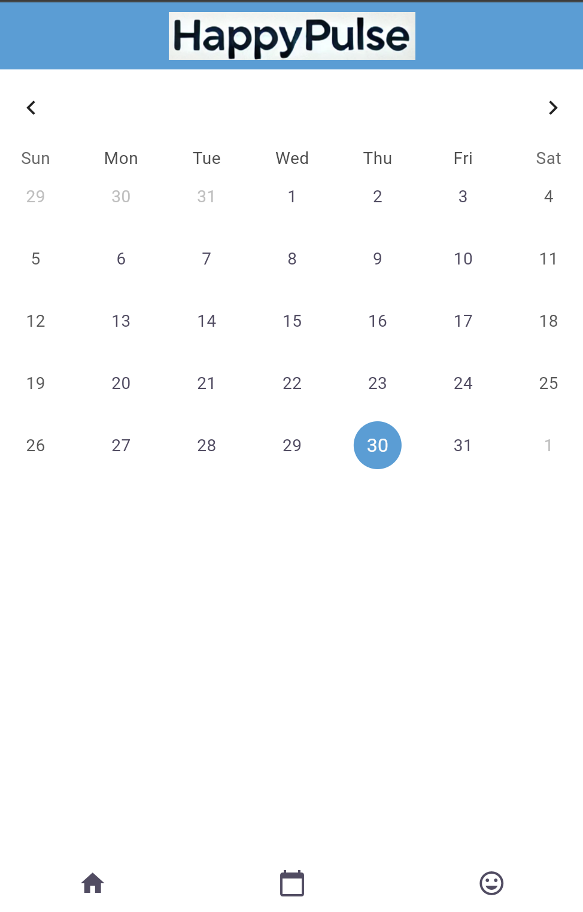

# Flutter Projesi


## Proje Hakkında

[Projemin adı HappyPulse. Regl takip uygulaması gibi düşünebilirsiniz. Bu projeyle regl döngüsünün başlamasına ne kadar zaman kaldığını kolayca hesaplayabilir ve modunu seçebilirsin.]


## Ekibimiz

-  **Danışman:**  
   [https://github.com/ramiko2](Rabiya Tanbaş)


## Özellikler

- [Takvimden döngünü takip edebilirsin.]

- [Temayı değiştirebilirsin.]

- [Modunu değiştirebilirsin.]


## Kullanılan Teknolojiler

- Flutter

- Dart


## Başlangıç


### Gereksinimler

- Flutter SDK (sürüm 3.24.5)

- Dart SDK (sürüm  3.5.4)


### Kurulum Adımları

1. Projeyi bilgisayarınıza indirin:

```bash

git  clone [git@github.com:ramiko2/HappyPulse.git]

```


2. Proje klasörüne gidin:

```bash

cd [HappyPulse]

```


3. Gerekli paketleri yükleyin:

```bash

flutter  pub  get

```


4. Uygulamayı başlatın:

```bash

flutter  run

```


lib/

├── modeller/ # Veri modelleri ve API veri yapıları │ ├── user.dart # Kullanıcı modelini tanımlar │ ├── cycle.dart # Regl döngüsü modeli │ └── mood.dart # Ruh hali modeli

├── ekranlar/ # Uygulamanın ekranları │ ├── BoardingScreen/ # Uygulama açılış ekranı │ ├── LoginScreen/ # Kullanıcı giriş ekranı │ ├── HomeScreen/ # Ana ekran │ ├── CalendarScreen/ # Regl takvim ekranı │ ├── MoodScreen/ # Ruh hali ekranı │ └── SettingsScreen/ # Uygulama ayarları ekranı

├── widgets/ # Tekrar kullanılabilir bileşenler │ ├── BottomNavigationBarWidget/ # Alt navigasyon çubuğu │ ├── CustomButton/ # Özelleştirilmiş buton │ └── CalendarCard/ # Takvim kartı bileşeni

├── servisler/ # API servisleri ve veri yönetimi │ ├── api_service.dart # API bağlantılarını yöneten servis │ └── auth_service.dart # Kullanıcı doğrulama servisi

└── yardımcılar/ # Yardımcı fonksiyonlar ├── date_utils.dart # Tarih hesaplama fonksiyonları ├── validation.dart # Giriş doğrulama fonksiyonları └── theme.dart # Tema ayarları dosyası


## Ekran Görüntüleri





## Projeye Katkı Sağlama

1. Projeyi forklayın

2. Yeni bir dal oluşturun (`git checkout -b ozellik/YeniOzellik`)

3. Değişikliklerinizi kaydedin (`git commit -m 'Yeni özellik eklendi'`)

4. Dalınıza gönderin (`git push origin ozellik/YeniOzellik`)

5. Pull Request oluşturun


## Lisans

[Lisans türü] kapsamında lisanslanmıştır. Daha fazla bilgi için `LICENSE` dosyasını inceleyebilirsiniz.


## İletişim

- Proje Bağlantısı: (https://github.com/ramiko2/HappyPulse)

- İstinye Üniversitesi: [https://www.istinye.edu.tr/](https://www.istinye.edu.tr/)


## Teşekkürler

- İstinye Üniversitesi'ne destekleri için teşekkür ederiz

- [Keyvan Hocaya teşekkürler.]


